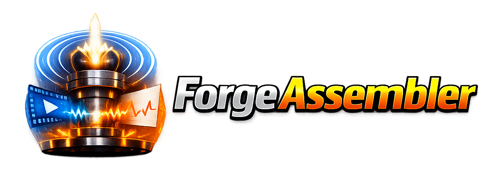

# ForgeAssembler

**Assemble many FunscriptForge clips into one long combined video and
funscript bundle.**

ForgeAssembler is the third tool in the Liquid Releasing family.
Where [FunscriptForge](https://github.com/liquid-releasing/funscriptforge)
shapes and polishes a single clip's funscripts and
[ForgeYT](https://github.com/liquid-releasing/forgeyt) pulls audio
from YouTube, ForgeAssembler is the tool that takes finished clips
and concatenates them — videos, every funscript channel, chapter
markers — into one long output.

---

## What it does

- Concatenates videos into a single MP4 at your chosen resolution.
- Concatenates every funscript channel in lockstep: main, multi-axis,
  3-phase estim, prostate, and more.
- Drops in joiners between sections: straight cuts, fade-to-black
  with configurable hold and fade times, closing fade at the end.
- Writes chapter markers, one per section, into the MP4.
- Normalizes audio loudness to the YouTube standard (−16 LUFS).
- Per-section overlays: image (PNG/JPG with alpha), audio (music
  beds / ambience), or text (system-font title cards).
- Renders a heatmap of the main funscript track alongside the output.
- Saves the whole project as a reusable JSON file — hand-edit it,
  script it, version it.

A full feature list lives on the [Features](FEATURES.md) page.

---

## Getting started

New to ForgeAssembler? Start with **[Getting Started](guide/getting-started.md)** —
install, first forge, and pointers into the rest of the guide. End-to-end
in about ten minutes.

Ready to go deeper? The **User Guide** covers
[sections & segments](guide/sections-and-segments.md),
[overlays](guide/overlays.md),
[joiners](guide/joiners.md),
[output channels](guide/channels.md), and
[debug mode](guide/debug-mode.md).

---

## Download

Binaries land on the
[forgeassembler-releases](https://github.com/liquid-releasing/forgeassembler-releases)
repository, one per platform (Windows, macOS, Linux). Watch that repo
for new tags.

---

## Community

Questions, feedback, bug reports: join the
[Liquid Releasing Discord](https://discord.gg/sZWCqgxY).

---

*ForgeAssembler is free software under the
[MIT License](https://github.com/liquid-releasing/forgeassembler/blob/main/LICENSE).
© 2026 Liquid Releasing.*
